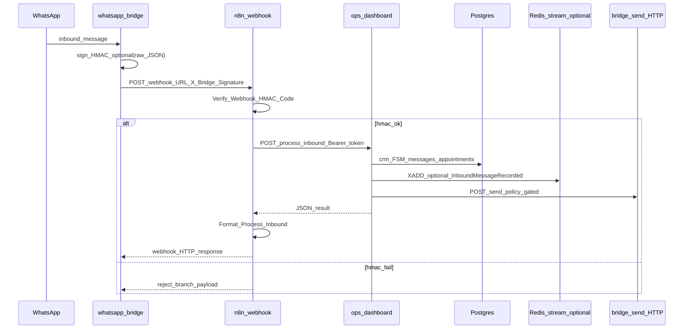

# Engineering report: n8n role after demotion + process-inbound + HMAC + outbox + FSM

**Scope:** Analysis grounded in repository artifacts as of this revision — not a generic n8n description.

**Primary sources:**

- Workflow: [`whatsapp-bridge/n8n-workflow-whatsapp-local.json`](../whatsapp-bridge/n8n-workflow-whatsapp-local.json) (`"active": false` in file — must be activated/imported in your n8n instance).
- Bridge → webhook: [`whatsapp-bridge/lib/waSession.js`](../whatsapp-bridge/lib/waSession.js), [`whatsapp-bridge/lib/webhookSign.js`](../whatsapp-bridge/lib/webhookSign.js).
- Ops unified path: [`ops-dashboard/app/api/internal/conversations/process-inbound/route.ts`](../ops-dashboard/app/api/internal/conversations/process-inbound/route.ts), [`ops-dashboard/lib/conversations/processInbound.ts`](../ops-dashboard/lib/conversations/processInbound.ts).
- Service-token read APIs for SaaS BFF (`apps/web`): [`ops-dashboard/app/api/internal/inbox/route.ts`](../ops-dashboard/app/api/internal/inbox/route.ts), [`ops-dashboard/app/api/internal/conversations/[id]/route.ts`](../ops-dashboard/app/api/internal/conversations/[id]/route.ts) (same SQL as cookie-auth routes, `GET ?clinic_id=`).
- Additional internal reads: [`internal/patients`](../ops-dashboard/app/api/internal/patients/route.ts), [`internal/appointments/upcoming`](../ops-dashboard/app/api/internal/appointments/upcoming/route.ts), [`internal/clinic-saas-link`](../ops-dashboard/app/api/internal/clinic-saas-link/route.ts) (tenant UUID link for hybrid .NET billing).
- Legacy CRM HTTP (still defined in workflow, **not** on active path): [`ops-dashboard/app/api/internal/crm/inbound-ingest/route.ts`](../ops-dashboard/app/api/internal/crm/inbound-ingest/route.ts).
- Demotion intent: [`docs/N8N_CORE_DEMOTION.md`](N8N_CORE_DEMOTION.md), [`docs/DESIGN-n8n-orchestrator-only.md`](DESIGN-n8n-orchestrator-only.md) (design doc partially superseded by wiring below).
- Outbox (not executed inside n8n): [`ops-dashboard/lib/outbox/coreOutbox.ts`](../ops-dashboard/lib/outbox/coreOutbox.ts), [`ops-dashboard/app/api/internal/jobs/outbox-drain/route.ts`](../ops-dashboard/app/api/internal/jobs/outbox-drain/route.ts).

---

## 1) Current role of n8n

### What n8n actually does today (active path in bundled JSON)

After **HMAC verification**, the workflow’s **only connected success path** is:

`Webhook Inbound` → `Verify Webhook HMAC` → `HMAC OK?` (true) → **`Process Inbound Core`** (HTTP) → `Format Process Inbound` → `Respond Success`.

The **`Process Inbound Core`** node is an `httpRequest` to:

`POST {{OPS_DASHBOARD_URL}}/api/internal/conversations/process-inbound`

with `Authorization: Bearer {{SCHEDULING_SERVICE_TOKEN}}`, JSON body built from the webhook `body` (`clinic_id`, `from`, `text`, `messageId`, `receivedAt`, `execute_send: true`, `send_urgent_alert: true`, `enqueue_on_bridge_failure: true`), timeout **120000 ms**.

So n8n’s **live role** is:

1. **Public webhook receiver** (WhatsApp bridge hits n8n URL).
2. **HMAC gate** (Code node + IF).
3. **Thin HTTP proxy** to ops-dashboard for **all** CRM + scheduling FSM + synchronous WhatsApp send policy + optional outbox enqueue on bridge failure.

**Logic location:** Almost all business logic (normalize rules parity, `crmUpsertInbound`, interpret/slots/booking dialogue, `sendViaBridge`, `core_outbox`, Redis domain events) lives in **ops-dashboard**, not in n8n Code nodes, on this path.

### Orchestrator vs logic

| Layer | Role |
|-------|------|
| n8n | Transport + HMAC + single HTTP fan-out + response shaping (`Format Process Inbound`) |
| ops-dashboard | CRM, FSM, scheduling decisions, persistence, bridge send, outbox |

So n8n is **mostly an orchestrator / edge adapter**, not the system of record.

### Nodes on the active path (connected from `Webhook Inbound` forward)

- `Webhook Inbound`
- `Verify Webhook HMAC`
- `HMAC OK?`
- `Process Inbound Core`
- `Format Process Inbound`
- `Respond Success`

On HMAC failure branch:

- `HMAC OK?` (false) → `Respond HMAC Rejected` (no further `connections` entry — execution ends there for that branch; webhook `responseMode: lastNode` applies to last executed node in practice).

### Nodes present but **not** on the active graph (dead / legacy subgraph)

In `connections`, **nothing** connects **into** `Normalize Input`. Therefore the entire legacy subgraph that starts at `Normalize Input` is **unreachable** from the webhook in the shipped file, including at least:

- `Normalize Input`, `Has Sender?`, `CRM Upsert Inbound`, `Flatten CRM Response`, `Is Duplicate?`, `Respond Duplicate`
- `Scheduling Engine` (large Code node calling `interpret` + `slots`)
- `Rules Fallback`, `Update Conversation State`, `Decision Gate`, `Create Case`, `Build Alert`, `Log Alert`, `Has Alert Target?`, `Send Urgent Alert`, `Prepare Reply`, `CRM Log Outbound`, `Send Reply via Bridge`, `Assess Send Result`
- `Audit DLQ` (only on `CRM Upsert Inbound` **error** output — unreachable if CRM node never runs)

**Engineering implication:** The JSON still contains **duplicate definitions** of normalization / scheduling / SQL side effects for documentation or rollback, but they **do not execute** on the default wired path. Risk: an operator re-links `HMAC OK?` → `Normalize Input` by mistake and **double-writes** vs ops (see §6).

---

## 2) Full data flow (detailed)

### Step-by-step

| Step | What happens | What is sent | What is stored | Failure modes |
|------|----------------|--------------|----------------|----------------|
| 1. WhatsApp → Bridge | `waSession` builds `bodyObj` (`clinic_id`, `from`, `text`, `messageId`, …), `JSON.stringify`, optional `X-Bridge-Signature: sha256=<hex>` via `signPayload(secret, raw)` | Raw JSON body + headers to `config.webhookUrl` | Nothing yet in DB from bridge alone | Bridge offline; wrong `webhookUrl` |
| 2. Bridge → n8n | `axios.post` synchronous from inbound handler path | Same JSON + HMAC header | n8n execution log (n8n internal) | n8n down → `webhook_forward_fail_total`, optional **NDJSON disk queue** (`inbound_webhook_queue` per RUNBOOK) |
| 3. n8n Verify HMAC | Code node: if `N8N_WEBHOOK_HMAC_SECRET` empty → `hmacOk: true` (**verification skipped**); else HMAC-SHA256 over **canonical** `{clinic_id, sender, from, text, messageId, timestamp, receivedAt}` must match header hex | — | — | Secret mismatch → `Respond HMAC Rejected`; bridge treats `ok:false` + `hmac` in body as hard fail (see `postInboundWebhook`) |
| 4. n8n → ops `process-inbound` | Single HTTP; Bearer `SCHEDULING_SERVICE_TOKEN` | Full inbound + flags | Messages, conversations, appointments, alerts, `core_outbox` rows as coded | ops 5xx/timeout → n8n execution fails (no automatic n8n-side retry on this node unless configured in n8n); bridge may have **already** queued webhook if POST threw earlier |
| 5. ops → DB | `processInboundMessage` / services | SQL transactions, advisory-style locks where implemented | All CRM tables touched in code path | DB down → 500 to n8n |
| 6. ops → Redis (optional) | `publishInboundMessageRecorded` if `REDIS_URL` set | Stream payload | `domain_events` append (separate path) | Redis down: sync path continues; stream/event may drop |
| 7. ops → Bridge `/send` | `sendViaBridge` + global throttle + policy | POST to bridge internal URL | Outbound row in `messages` etc. | Bridge token / policy block |
| 8. Outbox (async) | **Not in n8n** — `enqueueCoreOutbox` on bridge failure from ops; **cron** hits `outbox-drain` | Internal POST with token | `core_outbox` state machine | Misconfigured token; HARD DROP policies |

**Important correction to a linear mental model:** Outbox drain does **not** run *through* n8n; it is ops internal + scheduler/n8n **Schedule Trigger** can call the route (per RUNBOOK) but that is separate from inbound webhook flow.

---

## 3) Security model

### HMAC — where and how

- **Bridge:** [`webhookSign.js`](../whatsapp-bridge/lib/webhookSign.js) — `HMAC-SHA256(secret, rawBodyUtf8)` hex digest; header `X-Bridge-Signature: sha256=<hex>`.
- **n8n first business node:** `Verify Webhook HMAC` in workflow JSON — `timingSafeEqual` on hex digests; canonical body must align with bridge `JSON.stringify` field order (`waSession` object literal order).

### If HMAC fails

- n8n: false branch → `Respond HMAC Rejected` (`ok: false`, `error: hmac_rejected`-style fields in Set node).
- Bridge: if response body indicates HMAC rejection, **does not queue** retry (`waSession.js` lines ~238–240).

### Bypass surfaces

| Vector | Reality |
|--------|---------|
| Call `process-inbound` directly | Possible if `SCHEDULING_SERVICE_TOKEN` leaks — same as any internal API. Mitigation: token only on private network / secret manager. |
| n8n webhook without secret | If `N8N_WEBHOOK_HMAC_SECRET` **unset in n8n**, node sets `hmacOk: true` — **dev-only risk** if webhook is exposed publicly. |
| Bridge send | `BRIDGE_SEND_TOKEN` on bridge `/send`; ops uses `sendViaBridge` with policy gate (`globalReplyPolicy`). |

### Internal APIs

- [`assertSchedulingServiceToken`](../ops-dashboard/lib/internalAuth.ts) on `process-inbound`, `inbound-ingest`, scheduling routes, `outbox-drain`, etc.

---

## 4) Error handling & reliability (n8n-specific)

### Duplicate messages

- **Not decided in n8n** on active path — ops `crmUpsertInbound` + `processInbound` return `duplicate`; bridge duplicate behavior is upstream of n8n.
- Legacy `Is Duplicate?` node exists but is **unreachable** in current `connections`.

### HTTP failures / timeouts

- `Process Inbound Core`: timeout **120 s**; no `onError: continueErrorOutput` on that node in JSON (unlike legacy `CRM Upsert Inbound` which had error → `Audit DLQ`).
- If ops is down: n8n execution **fails**; bridge sees non-2xx → queue webhook retry (unless HMAC rejection path).

### Retries / DLQ

- **n8n:** Retry semantics depend on n8n version/settings for failed nodes — **not encoded** in the JSON for `Process Inbound Core`.
- **Bridge:** disk queue + metrics for webhook forward (`bridge_inbound_webhook_*`).
- **ops DLQ:** `dead_letter_events` / `processed_events` are **event-consumer** concerns, not n8n inbound webhook.

### ops-dashboard or DB down

- Webhook POST fails from bridge perspective → queued retry / metrics.
- No automatic “process later” for the **synchronous** patient reply inside ops unless outbox path was triggered (bridge send failure path).

---

## 5) Performance analysis

### Latency added by n8n (active path)

Rough components:

1. Network: Bridge → n8n (often Docker DNS / LAN).
2. n8n cold start / worker scheduling (usually small vs 120s upstream timeout).
3. n8n → ops second hop (same LAN typical).
4. ops work dominates (Postgres + optional Redis + bridge send).

**Order of magnitude:** n8n adds **one extra HTTP hop + HMAC Code execution** — typically **tens to low hundreds of ms** when healthy, **not** seconds, unless n8n or network is saturated.

### Blocking

- Bridge `forwardToN8n` uses **`await axios.post`** — inbound handling **waits** for n8n response, which waits for ops. So the chain is **blocking end-to-end** for that WhatsApp handler.

### Bottleneck risk

- **Single n8n instance** processing webhooks serially per worker configuration can cap throughput before ops or Postgres.
- **n8n execution history / DB** growth can slow instance over time (operational n8n concern).

### Messages/sec upper bound

Not hard-coded in repo. Bounded by:

- WhatsApp client receive rate,
- Node bridge single-threaded handling,
- n8n concurrency settings,
- ops `WHATSAPP_OPS_SEND_MAX_PER_WINDOW` throttle (~10/s per ops process) + bridge `rateSafety`.

---

## 6) Limitations & risks (top 5)

1. **Dead legacy subgraph** in JSON — high **operational confusion** and risk of accidental rewiring causing **double processing** vs ops.
2. **`"active": false"`** in committed workflow — production may run an **older imported** graph if not reconciled.
3. **HMAC optional when secret unset** — insecure if webhook URL is exposed.
4. **Blocking chain** — n8n or ops latency directly hits patient reply latency; no queue between bridge and ops except bridge’s webhook disk queue on failure.
5. **No n8n-native DLQ** for `Process Inbound Core` failure — behavior depends on bridge queue + n8n global error workflow (if any), not first-class in JSON.

**Can n8n lose messages?** If bridge queue drops or misconfigured — yes at edge. If ops commits before responding — rare ordering issue; generally **DB is source of truth** after successful `process-inbound`.

**Duplicate requests?** Bridge retries can cause **duplicate n8n executions**; ops must dedupe (it does via CRM layer). **Race:** two parallel deliveries — mitigated by DB locks / idempotency in ops, not in n8n.

---

## 7) Comparison with ideal architecture

| Ideal (Kafka/Redis streams + microservices) | Current |
|---------------------------------------------|---------|
| Edge ingress → queue → consumer | Edge → **sync** n8n → **sync** ops |
| Stateless edge | n8n holds workflow state + credentials |
| Single code-owned pipeline | Split: bridge JS + n8n graph + ops TS |

**What should eventually leave n8n (per DESIGN + demotion docs):**

- Any remaining **Postgres** nodes (already disconnected but still in file).
- Long-running **Scheduling Engine** Code (disconnected; logic duplicated in ops `schedulingDecision` / `processInbound`).

**Delete n8n entirely?** Optional long-term. Short-term value: **visual ops**, non-dev triggers (Schedule → reminders), integrations (calendar, marketing) per RUNBOOK — keep as **integration hub** if team uses it.

---

## 8) Future plan (3 phases)

### Phase 1 — **Stabilize (now)**

- Confirm production n8n graph matches JSON **active path** (Process Inbound only).
- Remove or archive dead connections/nodes in exported JSON to prevent misconfiguration.
- Ensure `006_domain_events` + monitoring (`health/deep`, outbox policies) on prod DB.

### Phase 2 — **n8n = automation layer only**

- Inbound: optional **bridge → ops directly** (bypass n8n) *or* keep n8n only as signed relay with zero business nodes.
- n8n: schedules + integrations calling **already-idempotent** internal APIs.

### Phase 3 — **Replace or shrink n8n**

- If team standardizes on code-only ops: move schedules to worker/cron + remove n8n.
- If integrations stay visual: keep n8n for **non-critical** paths only.

---

## 9) Final verdict

| Criterion | Score /10 | Comment |
|-----------|-----------|---------|
| **Reliability** | **7** | Solid when ops is healthy; weak spots are blocking chain + dead-node confusion + workflow import drift. |
| **Scalability** | **6** | Extra hop + n8n single-tenant bottleneck; ops/DB usually limit first. |
| **Maintainability** | **5** | Two sources of truth in one JSON file (live vs legacy) hurts reviews. |

**Overall:** n8n in this repo is a **production-acceptable thin edge** *provided* the live graph is the **Process Inbound Core** path, secrets are set, and operators do not re-enable the disconnected SQL subgraph. It is best viewed as a **transitional orchestrator** until ingress moves to direct bridge→ops or a dedicated API gateway.

---

## References (code index)

- Workflow graph: `whatsapp-bridge/n8n-workflow-whatsapp-local.json` (`connections` from line ~734).
- Bridge HMAC + forward: `whatsapp-bridge/lib/waSession.js` (`forwardToN8n`, `postInboundWebhook`).
- Ops entry: `ops-dashboard/app/api/internal/conversations/process-inbound/route.ts`.
- Auth pattern: `ops-dashboard/lib/internalAuth.ts`.
