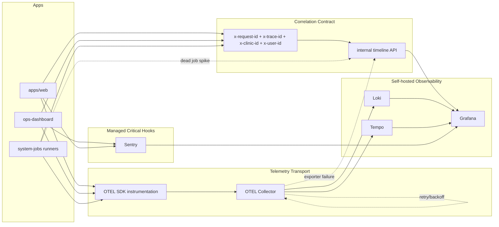

# P4 Day 2 - Hybrid Observability Architecture

## Failure Paths

- **Missing trace:** if `trace_id` is absent, fallback to `request_id` for timeline correlation.
- **Collector downstream failure:** OTEL Collector queue + retry keeps data in-memory and degrades to internal timeline.
- **Dead job path:** `system_jobs.status=failed_dead` appears in timeline and triggers Sentry rule.
- **Sentry outage:** errors still persist in `error_aggregations` and timeline.
